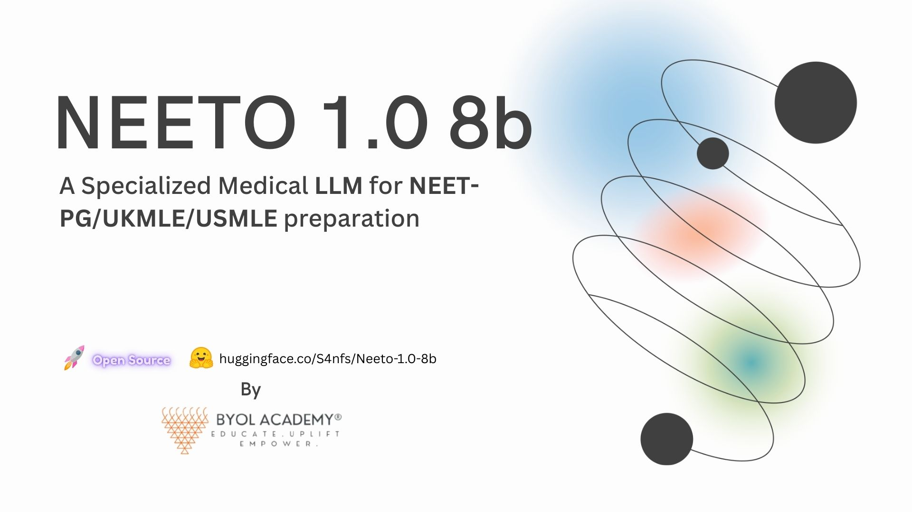
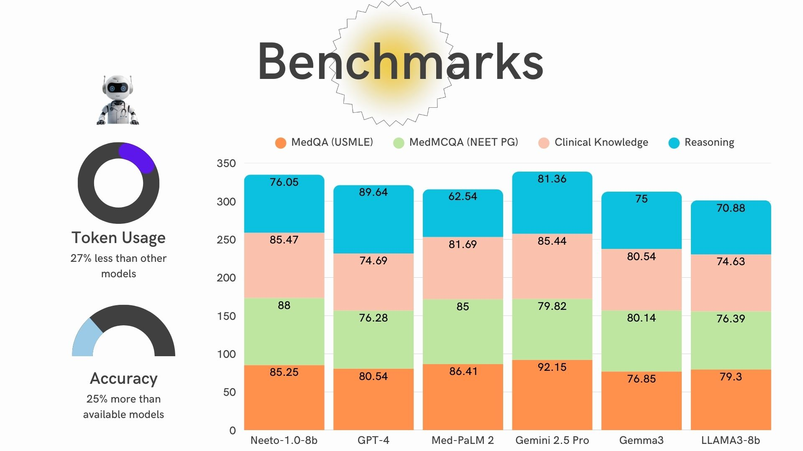

# Neeto-1.0-8b - A Specialized Medical LLM for NEET-PG/UKMLE/USMLE preparation


Neeto-1.0-8b is an openly released biomedical large language model (LLM) created by [BYOL Academy](https://byolacademy.com) to assist learners and practitioners with medical exam study, literature understanding, and structured clinical reasoning.

The model was adapted on a curated mixture (≈410K items) blending synthetic generations and hand-audited instructional / multiple‑choice / rationale samples. The objective was balanced: retain broad linguistic competence while strengthening factual recall, differential diagnostics framing, and question dissection for exams such as NEET‑PG, UKMLE, and USMLE.

Across widely used evaluation suites (MedQA, MedMCQA, PubMedQA, MMLU medical subsets), Neeto‑1.0‑8b attains strong 7B‑class results. Public benchmark numbers (table below) show it standing ahead of several prior open biomedical baselines of similar scale. The model will be used on our platform [Medicoplasma](https://medicoplasma.com) as for exam preparation and powering medical applications.

## How to Use

The model follows the default Llama‑3 chat message formatting (no explicit system prompt required). Provide a single user turn containing the question or case vignette; the model returns an answer (option selection, rationale, or free-form explanation depending on the prompt style).

Below are illustrative input patterns for multi‑choice items (MedQA / MedMCQA), PubMedQA‑style reasoning, and open clinical queries. For reproducibility of benchmark-style MCQ evaluation, keep choices clearly enumerated (A./B./C./D.) and avoid extra prose.

### Example (MedQA / MedMCQA style)

```
A 55-year-old male presents with sudden onset of severe unilateral flank pain radiating to the groin, accompanied by hematuria. Imaging reveals a calculus in the proximal ureter. Given the high prevalence of anatomical variations in the renal arteries and their proximity to the ureters, what is the primary clinical concern regarding surgical or interventional management of this patient's ureteral calculus, and which specific anatomical variation would most significantly complicate access or increase the risk of iatrogenic injury?

A. Aberrant accessory renal artery crossing the ureter, causing obstruction and risk of vascular injury during intervention.
B. Early bifurcation of the main renal artery within the hilum, increasing the risk of ureteral devascularization.
C. Dual renal veins draining into the inferior vena cava, raising concern for venous congestion during stone removal.
D. Persistent fetal renal lobulations that distort the renal pelvis and complicate stent placement.
```

### Inference with vLLM

```python
from transformers import AutoTokenizer
from vllm import LLM, SamplingParams

llm = LLM(model="S4nfs/Neeto-1.0-8b", trust_remote_code=True)
tokenizer = AutoTokenizer.from_pretrained("S4nfs/Neeto-1.0-8b")
sampling_params = SamplingParams(temperature=0.7, top_p=0.9, max_tokens=1024, stop=["<|eot_id|>"])

messages = [
    {"role": "user", "content": """The question format used in the above input examples。"""},
]
prompts = tokenizer.apply_chat_template(messages, tokenize=False, add_generation_prompt=True)
print(prompts[0])
"""
<|begin_of_text|><|start_header_id|>user<|end_header_id|>

{question}<|eot_id|><|start_header_id|>assistant<|end_header_id|>

"""

outputs = llm.generate(prompts=prompts, sampling_params=sampling_params)
print(outputs[0].outputs[0].text)
```

Note: Current release is optimized for single‑turn exchanges. Multi‑turn conversational coherence will be improved in an upcoming iteration.

## Benchmark with Major Models



## Benchmark Snapshot Among Similar Size Models

Neeto‑1.0‑8b delivers the following published scores:

| Released Date |        Model        | Average | MedQA | MedMCQA | PubMedQA | MMLU.ck | MMLU.mg | MMLU.an | MMLU.pm | MMLU.cb | MMLU.cm |
| :-----------: | :-----------------: | :-----: | :---: | :-----: | :------: | :-----: | :-----: | :-----: | :-----: | :-----: | :-----: |
|    2025.08    |  **Neeto-1.0-8b**   |  87.87  | 87.8  |  66.2   |   79.0   |  79.4   |  90.1   |  79.1   |  95.6   |  81.4   |  78.6   |
|    2024.04    |    OpenBioLM-8B     |  72.48  | 59.0  |  56.9   |   74.1   |  76.1   |  86.1   |  69.8   |  78.2   |  84.2   |  68.0   |
|    2024.04    | Llama-3-8B-Instruct |  71.23  | 62.4  |  56.5   |   75.8   |  72.5   |  84.0   |  71.1   |  70.6   |  80.6   |  67.6   |
|    2024.04    |    Internist-7B     |  67.79  | 60.5  |  55.8   |   79.4   |  70.6   |  71.0   |  65.9   |  76.1   |    -    |  63.0   |
|    2024.02    |      Gemma-7B       |  64.18  | 47.2  |  49.0   |   76.2   |  69.8   |  70.0   |  59.3   |  66.2   |  79.9   |  60.1   |
|    2024.03    |     Meerkat-7B      |  63.94  | 74.3  |  60.7   |    -     |  61.9   |  70.4   |  61.5   |  69.5   |  55.4   |  57.8   |
|    2023.03    |      MedAlpaca      |  58.03  | 41.7  |  37.5   |   72.8   |  57.4   |  69.0   |  57.0   |  67.3   |  65.3   |  54.3   |
|    2024.02    |    BioMistral-7B    |  57.26  | 46.6  |  45.7   |   68.1   |  63.1   |  63.3   |  49.9   |  57.4   |  63.4   |  57.8   |

Interpretation & Methodology:

- MedQA uses the US 4‑option subset; MedMCQA uses the Dev split; PubMedQA reflects the “reasoning required” subset.
- MMLU medical grouping here incorporates: Clinical Knowledge (CK), Medical Genetics (MG), Anatomy (An), Professional Medicine (PM), College Biology (CB), College Medicine (CM).
- Greedy decoding was the baseline; ensemble self‑consistency scores (not shown) were generated via 10 samples (temperature 0.7, top_p 0.9) with majority voting.
- Comparative baselines partially sourced from the public Open Medical‑LLM Leaderboard.

## Training Configuration

Full‑parameter supervised fine‑tuning was executed under Fully Sharded Data Parallel (FSDP). Hardware: 8 × H200 GPUs (~29 hours wall time).

Hyperparameters:

- torch type: bfloat16
- epochs: 3
- learning rate: 2e-5
- learning rate scheduler type: cosine
- warmup ratio: 0.04
- max length: 1024
- global batch size: 128

## Limitations & Responsible Use

Despite strong benchmark standing, the model can hallucinate mechanistic explanations, mis-rank differential diagnoses, or fabricate citations. It must not be used for autonomous clinical decision-making, patient triage, prescribing, or emergency guidance. Human expert verification is mandatory before any medical action.

## Planned Enhancements

- Preference optimization (DPO) variants on forthcoming Llama releases.
- Expansion to JEE Advanced and NEET‑UG aligned scientific subject packs.
- Multi-turn dialogue memory and structured rationale modes.
- Integration within MedicoPlasma’s chat interface.

## Citation

```latex
@misc{Neeto-1.0-8b,
  author = {Sagar Verma},
  title = {NEETO: A Specialized Medical LLM for NEET-PG/UKMLE/USMLE preparation},
  year = {2025},
  publisher = {GitHub},
  journal = {GitHub repository},
  note = {\url{https://huggingface.co/S4nfs/Neeto-1.0-8b}},
}
```
